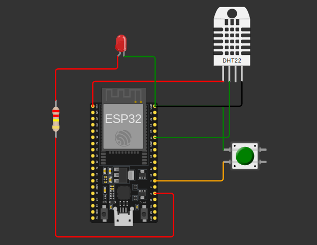

# RTOS Basics on ESP32

This project demonstrates a simple FreeRTOS-based multitasking application on an ESP32 using the Arduino framework. It reads temperature and humidity from a DHT22 sensor, blinks an LED in a separate task, sends sensor data through a queue, and stops all running tasks when a panic button is pressed.

## Features

- FreeRTOS task-based design on ESP32
- Independent LED blink task
- DHT22 temperature and humidity monitoring
- Queue-based communication between sensor and serial tasks
- Panic button to suspend all active tasks
- Compatible with PlatformIO and Wokwi simulation

## Project Structure

```text
.
├── src/main.cpp        # Main application with FreeRTOS tasks
├── platformio.ini      # PlatformIO board and library configuration
├── diagram.json        # Wokwi circuit wiring
├── wokwi.toml          # Wokwi firmware mapping
└── README.md           # Project documentation
```

## Hardware Used

- ESP32 DevKit V1
- DHT22 sensor
- LED
- Push button
- Resistor

## Pin Configuration

| Component | ESP32 Pin |
|-----------|-----------|
| LED       | GPIO 2    |
| Button    | GPIO 4    |
| DHT22     | GPIO 21   |

## How It Works

The firmware creates four FreeRTOS tasks:

1. `ledTask`
   Blinks the LED every 250 ms.

2. `sensorTask`
   Reads temperature and humidity from the DHT22 every 2 seconds and sends the data to a queue.

3. `serialTask`
   Receives sensor data from the queue and prints it to the serial monitor.

4. `panicTask`
   Monitors the push button and suspends the other tasks when the button is pressed.

## Expected Serial Output

```text
LED Task Running
Temperature: 27.10 °C, Humidity: 61.00 %
LED Task Running
Temperature: 27.20 °C, Humidity: 60.80 %
Panic Button Pressed! All tasks stopped.
```

## Dependencies

This project uses the following PlatformIO libraries:

- `adafruit/Adafruit Unified Sensor`
- `adafruit/DHT sensor library`

## Run with PlatformIO

1. Open the project in VS Code with the PlatformIO extension installed.
2. Build the firmware:

```bash
pio run
```

3. Upload to the ESP32:

```bash
pio run --target upload
```

4. Open the serial monitor:

```bash
pio device monitor
```

## Run with Wokwi

1. Build the project so the firmware files are generated in `.pio/build/esp32doit-devkit-v1/`.
2. Open the Wokwi simulation using `diagram.json` and `wokwi.toml`.
3. Start the simulator and watch the serial monitor output.

## Image / Screenshot



## Notes

- The panic button uses `INPUT_PULLUP`, so pressing the button pulls the input LOW.
- Once panic mode is triggered, the LED, sensor, and serial tasks are suspended.
- The main `loop()` remains empty because task scheduling is handled by FreeRTOS.
